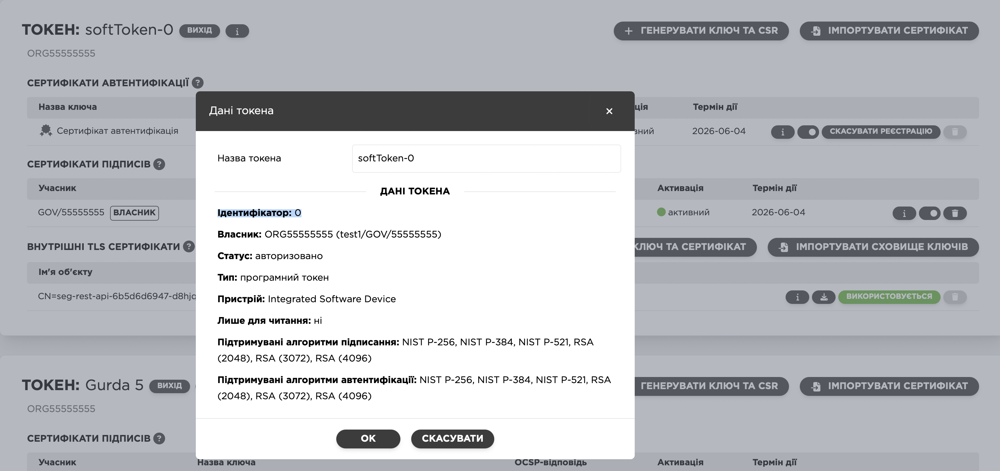
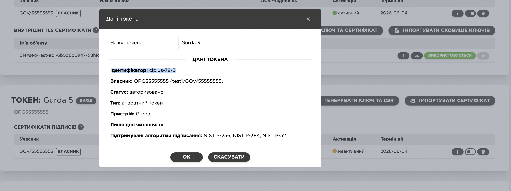
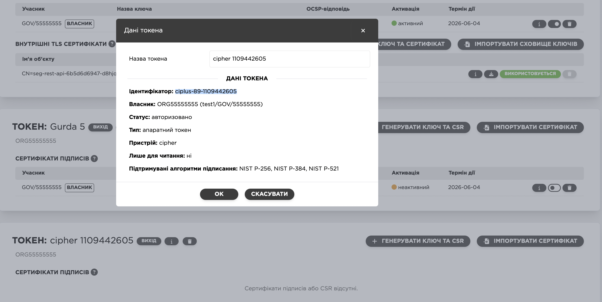

# token-initializer for Trembita 2.0 Proxy (Kubernetes Integration)

This utility is used for automated login to tokens (software or HSM) in the **Trembita 2.0 Proxy** component deployed in **Kubernetes**.

## 📦 Description

The utility reads the `UXP_TOKENS_PASS` environment variable, which must contain a list of `token-id:password` pairs, separated by commas:

```bash
UXP_TOKENS_PASS="0:1233,ciplus-78-5:##user##pass,ciplus-89-1109442605:12345678"
```

Each pair follows the format: `token-id:password`.

> ⚠️ Please **do not use colons (`:`) or commas (`,`) inside token passwords** — this isn’t YAML parsing magic and the parser will break.

### 🔐 Examples of Supported Tokens

- `0:1233`  
  → A software token provided by Trembita 2.0. Software tokens are numbered `0–9`. When a new Security Server (ШБО) is created, the first token is typically `0`.

- `ciplus-78-5:##user##pass`  
  → A token-password pair for a **Gryada-301 HSM**. Gryada often requires both a cell login and password. The format `##user##pass` includes:
  - `user`: login for the HSM cell
  - `pass`: password for that cell

- `ciplus-89-1109442605:12345678`  
  → A token-password pair for a **Cipher HSM**.

### 🆔 Where to Find `token-id`?

To determine the correct `token-id` to use (such as `0`, `ciplus-78-5`, or `ciplus-89-1109442605`):

1. Open the **Trembita 2.0 Security Server Web UI**.
2. Navigate to the **"Keys and Certificates"** tab.
3. Locate the value under the column `Token ID` — that is what you should use in `UXP_TOKENS_PASS`.

**Soft Token Example (token-id = 0)**  


**Gryada-301 HSM Example (token-id = ciplus-78-5)**  


**Cipher HSM Example (token-id = ciplus-89-1109442605)**  


### How it works

1. If `UXP_TOKENS_PASS` is not set, the utility exits with an error.
2. If set, the string is split into key:value pairs and processed sequentially.
3. For each pair:
   - Runs [`token_login`](https://github.com/kshypachov/token_login) with `-w <id> <password>` to set the password.
   - If it fails, the utility enters **infinite wait** to prevent further retries.
4. Then performs 10 iterations:
   - Runs [`trembita-healthcheck`](https://github.com/kshypachov/trembita-healthcheck) to verify the proxy is operable.
   - Runs `token_login -r <id>` to verify the token accepted the password.
   - Any failure → enters infinite wait.

After all tokens are processed:
- If the last `trembita-healthcheck` fails → infinite wait.
- If successful → exits with code 0.

## ♻️ Why infinite waiting?

This utility **never retries failed passwords**.  
Some HSMs allow **only 5 incorrect attempts** before locking. To avoid this, the program enters an infinite sleep if an error occurs — preventing Pod restart loops that could exhaust the retry limit.

## ☸️ Usage in Kubernetes

This utility is typically used in a `startupProbe` to delay service readiness:

```yaml
startupProbe:
  exec:
    command:
      - token-initializer
  timeoutSeconds: 300
  initialDelaySeconds: 20
  periodSeconds: 20
  failureThreshold: 1000000
```

- The `failureThreshold` is set to `1000000` to allow up to ~11 days before the Pod is marked as failed and wir restart.
- If something goes wrong, your monitoring tools will have **plenty of time** to alert you.
- 1,000,000 seconds ≈ **11 days**, giving you plenty of time to fix things or panic.
- With 4 startup attempts per failed Pod, you’ve got nearly **1.5 months** before most HSMs lock.  
  So take a breath. Enjoy some ☕.

> Bonus: with 4 startup attempts per failure, you have about **1.5 months** before an HSM with a 5-attempt limit is locked out.

## ✅ Exit Codes

| Code | Meaning |
|------|---------|
| `0`  | All tokens processed successfully. |
| `1`  | (Rare) Error occurred **before** infinite waiting started — see logs. |
| —    | No exit at all — the script entered infinite waiting to prevent token lockout. |

## 🔗 Dependencies

- [`token_login`](https://github.com/kshypachov/token_login)
- [`trembita-healthcheck`](https://github.com/kshypachov/trembita-healthcheck)

Make sure both are in the container’s `PATH`. Or else… infinite sleep again.

## 📄 License

MIT or other, if applicable.

---

> _“token-initializer doesn't retry, it reflects.”_

